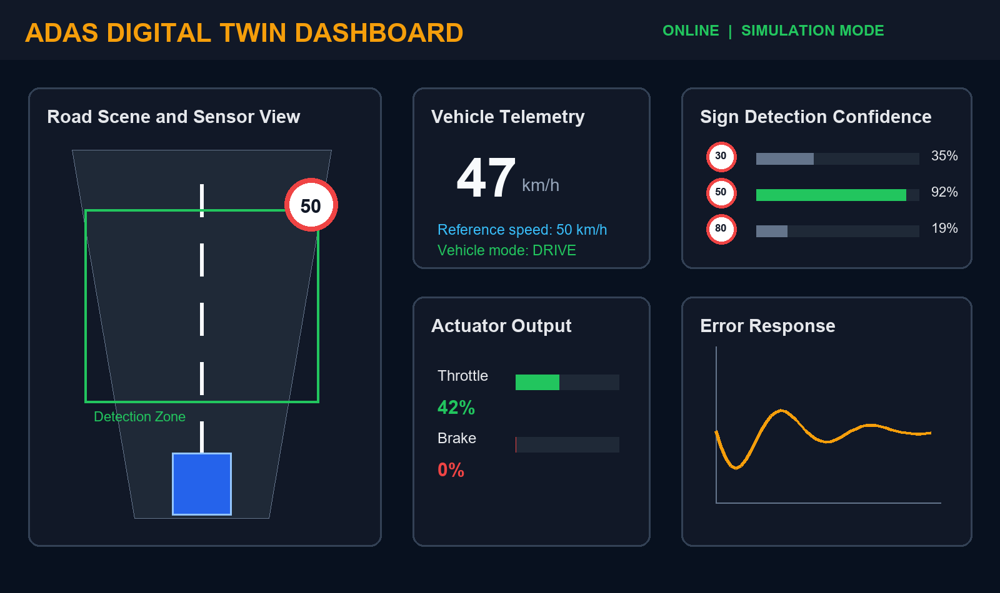
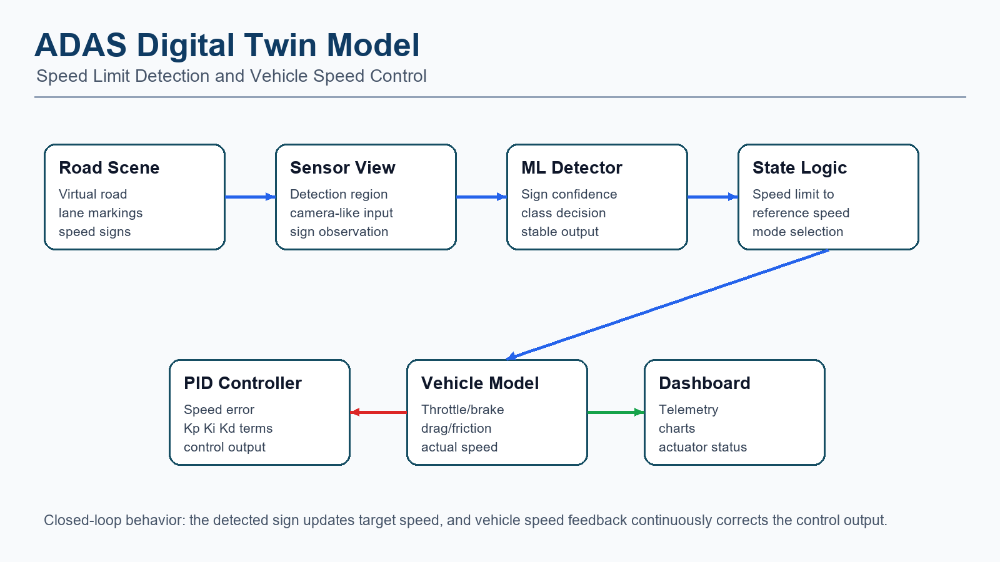

# ADAS Digital Twin Model

An interactive Advanced Driver Assistance System (ADAS) digital twin for **speed limit sign detection** and **vehicle speed control**. The project simulates a vehicle moving through a virtual road scene, detects speed limit signs, converts the detection into a reference speed, and regulates the vehicle using a closed-loop PID control approach.

## Project Preview

## Overview

This project demonstrates how a digital twin can be used to model, test, and visualize an ADAS speed-control pipeline before real-world deployment. The simulation connects perception, decision logic, control, and vehicle dynamics in a single dashboard.

The system includes:

- Virtual road scene and sensor-view simulation
- Speed limit sign detection confidence display
- Reference speed generation from detected signs
- PID-based longitudinal vehicle speed control
- Throttle and brake actuator visualization
- Vehicle mode display such as drive and deceleration
- Error response chart for controller behavior
- Simulink model files for ADAS digital twin experimentation

## System Architecture

The digital twin follows a closed-loop architecture:

1. A virtual road scene generates speed limit signs.
2. The sensor view observes signs inside the detection region.
3. The detection module estimates sign class confidence.
4. State logic converts the detected speed sign into a reference speed.
5. A PID controller compares actual speed with reference speed.
6. Throttle or brake output is applied to the vehicle dynamics model.
7. Vehicle telemetry is visualized on the dashboard.

## Repository Contents

| File / Folder | Description |
| --- | --- |
| `digital_twin_adas.html` | Browser-based ADAS digital twin dashboard and simulation |
| `mpsimulationv5_2.slx` | Simulink model file for the ADAS digital twin |
| `mpsimulationv8_2.slx.r2025a` | Simulink model variant saved for MATLAB/Simulink R2025a |
| `docs/images/` | README images and project visual diagrams |
| `generate_readme_images.py` | Utility script used to generate the README images |

## How to Run

### Web Dashboard

Open `digital_twin_adas.html` in any modern web browser.

The dashboard runs as a standalone HTML simulation and does not require a backend server.

### Simulink Model

Open the `.slx` model in MATLAB/Simulink. The R2025a model variant is also included for compatibility with newer Simulink versions.

## Core Features

- **Speed Sign Detection Simulation:** Shows detection confidence for possible speed limit signs.
- **Reference Speed Logic:** Updates target speed based on detected road signs.
- **PID Speed Control:** Reduces error between reference speed and actual speed.
- **Vehicle Dynamics:** Simulates longitudinal speed response using throttle, braking, drag, and friction effects.
- **Dashboard Visualization:** Displays road scene, speedometer, control output, error chart, and system status.

## Technology Used

- HTML, CSS, and JavaScript for the interactive dashboard
- MATLAB/Simulink for model-based simulation files
- Python and Pillow for generated README visuals
- Digital twin and ADAS control-system concepts

## Applications

- ADAS concept demonstration
- Vehicle speed-control algorithm testing
- Digital twin based simulation and visualization
- Academic project submission and presentation
- Foundation for future lane detection, adaptive cruise control, and obstacle avoidance work

## Future Scope

- Add real image-based traffic sign recognition
- Integrate lane detection and lane keeping assistance
- Add obstacle detection and adaptive cruise control
- Include hardware-in-the-loop testing
- Connect the digital twin with real sensor or vehicle data

## Author

**Harsh Chandak**  
PRN: **1032233469**  
Project: **ADAS Digital Twin**
